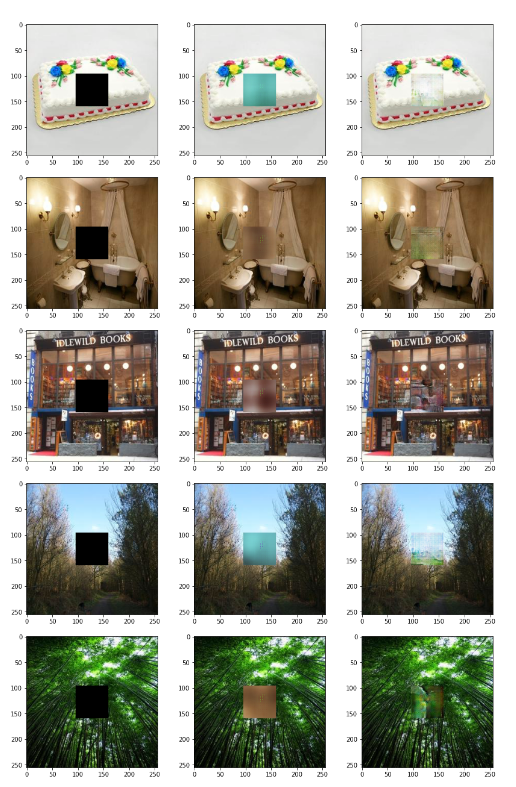

# Image_Inpainting
Implementation of Context Encoder for Image Inpainting

## Data preparation
1. Put the dataset into <pre>'./testSet_Resize/'</pre>
2. Make two directories, <pre>'./data_places_gt'</pre> to store the unmasked images, and <pre>'./data_places_mask'</pre> to keep the center masked images. 
3. Crop out middle 64 X 64 portion from all images. Run scripts/data_prepare.ipynb

## Training Variational AutoEncoder with VGG like encoder network
Run VAE.py in a tmux session.
<pre>$tmux new -s ImgInp</pre>
<pre>$python3 VAE.py</pre>
Press Ctrl + B + D to detach from tmux session. To reattach to session at a later time, 
<pre>$tmux a -t ImgInp</pre>

## Training Variational AutoEncoder with AlexNet like encoder network
Run AlexNet.py in a tmux session.
<pre>$tmux new -s ImgInp</pre>
<pre>$python3 AlexNet.py</pre>
Press Ctrl + B + D to detach from tmux session. To reattach to session at a later time, 
<pre>$tmux a -t ImgInp</pre>

## Training Variational AutoEncoder with ResNet like encoder network
Run VAE_ResNet.py in a tmux session.
<pre>$tmux new -s ImgInp</pre>
<pre>$python3 VAE_ResNet.py</pre>
Press Ctrl + B + D to detach from tmux session. To reattach to session at a later time, 
<pre>$tmux a -t ImgInp</pre>

## Training Context Encoder with Adversarial loss (GAN) 
Run gan.py
<pre>$tmux new -s ImgInp</pre>
<pre>$python3 gan.py</pre>
Press Ctrl + B + D to detach from tmux session. To reattach to session at a later time, 
<pre>$tmux a -t ImgInp</pre>

## Training Context Encoder with Adversarial loss with ResNet encoder in Generator network(GAN)
Run gan.py
<pre>$tmux new -s ImgInp</pre>
<pre>$python3 gan_resnet.py</pre>
Press Ctrl + B + D to detach from tmux session. To reattach to session at a later time, 
<pre>$tmux a -t ImgInp</pre>

To restore training from previous checkpoint, pass restore = True to the training() function in the last line of the script. 

## Technical Report 
* [Samveed Desai, Sambaran Ghosal. "Image Inpainting using Context Encoder" June 2022](report/ImageInpaintingContextEncoder.pdf)

## Results 
Below, we show some of the reconstructions obtained using VAE and GAN's 

|Left : Original , Middle : Reconstruction from Variational Autoencoder, Right : Reconstruction from Generative Adversarial Network|

